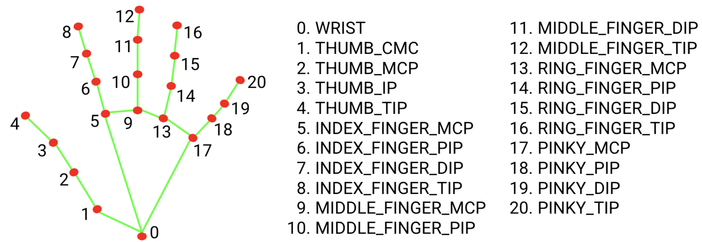

# Gesture-Based Volume Control System

This project demonstrates a basic Human-Computer Interaction (HCI) application that uses hand gestures to control the system's audio volume. By leveraging computer vision and hand-tracking technology, this project showcases how intuitive gestures can replace traditional input devices.

---

## Features

1. **Camera Check**:
   - Ensures the system's camera can capture video frames.
   - Provides a preview of the camera feed.

2. **Hand Tracking Module**:
   - Detects hands and their landmarks in real-time using MediaPipe.
   - Identifies hand gestures and calculates distances between landmarks.

3. **Gesture-Based Volume Control**:
   - Adjusts system volume based on the distance between the thumb and index finger (confirmation gesture).
   - Provides a visual representation of the current volume level on the screen.

---

## Project Structure

```
.
├── .idea/                 # PyCharm project settings
├── .venv/                 # Virtual environment folder
├── camcheck.py            # Script to verify camera functionality
├── HandTrackingModule.py  # Hand detection and gesture recognition module
├── VolumeHandControl.py     # Main script for gesture-based volume control
├── assets/
│   ├── Screenshots/       # Sample screenshots of the application in action
│   └── hand_landmarks.png # Reference image for hand landmarks
├── __pycache__/           # Cached Python files
```

---

## Requirements

- Python 3.7 or higher
- Dependencies:
  - OpenCV
  - MediaPipe
  - Pycaw
  - NumPy
  - Comtypes

Install dependencies using:

```bash
pip install opencv-python mediapipe numpy pycaw comtypes
```

---

## Setup

### Step 1: Initialize Virtual Environment
Ensure you are working inside the `.venv` folder to manage dependencies:

```bash
source .venv/bin/activate  # For Linux/MacOS
.venv\Scripts\activate    # For Windows
```

### Step 2: Test Camera
Run the `camcheck.py` script to verify that your camera is functional:

```bash
python camcheck.py
```

Press `q` to exit the camera feed.

### Step 3: Run Gesture-Based Volume Control
Execute the `VolumeHandControl.py` script to start controlling the volume:

```bash
python VolumeHandControl.py
```

---

## How It Works

### 1. **Camera Check**
- The `camcheck.py` script uses OpenCV to open the camera and display a live feed.
- Ensures that the camera can capture video frames without errors.

### 2. **Hand Tracking Module**
- The `HandTrackingModule.py` uses MediaPipe Hands to detect and track hands in real-time.
- Calculates positions of key landmarks (e.g., tips of fingers) for gesture recognition.
- Provides utility functions:
  - `findHands`: Draws hand landmarks and connections.
  - `findPosition`: Returns the coordinates of hand landmarks.
  - `fingersUp`: Detects which fingers are raised.
  - `findDistance`: Computes the distance between two landmarks.

### 3. **Gesture Control**
- The `VolumeHandControl.py` integrates the hand tracking module with Pycaw for volume control.
- Steps:
  1. Captures video frames using OpenCV.
  2. Detects hand landmarks and calculates the distance between the thumb and pinky finger.
  3. Maps the distance to the system's volume range (0% to 100%).
  4. Displays a visual feedback bar for the current volume level.

---

## References

- **Hand Landmarks**: The application uses MediaPipe Hands for detecting 21 hand landmarks. Below is a sample reference:



- **Screenshots**:

Screenshots of the application in action can be found in the `assets/screenshots/` folder.

---

## Controls

- **Volume Adjustment**:
  - Move your thumb and index finger closer or farther apart to decrease or increase the volume.
  - Pinky finger movement acts as confirmation for adjusting the volume.

- **Exit**:
  - Press `q` to quit the application.

---

## Future Improvements

1. **Multi-Gesture Support**:
   - Add more gestures for controlling other system functionalities.
2. **Multi-Platform Compatibility**:
   - Enhance support for operating systems beyond Windows.
3. **Advanced Hand Gesture Recognition**:
   - Incorporate additional gestures using machine learning.

---

## Acknowledgments

- **MediaPipe Hands**: For robust hand detection and tracking.
- **PyCaw**: For seamless audio volume control integration.
- **OpenCV**: For real-time video processing.
- **Tutorial**: This project was inspired and developed based on the tutorial by Murtaza Hassan from the [Murtaza's Workshop - Robotics and AI](https://youtu.be/9iEPzbG-xLE?si=pPyecu_Ns-MpguII) YouTube channel. Huge thanks to Murtaza for his clear and insightful explanations!

---

## Author

This project was developed by Sourajeet Sahoo as a basic exploration of Human-Computer Interaction (HCI) using computer vision. If you have any feedback or suggestions, feel free to contribute or reach out!